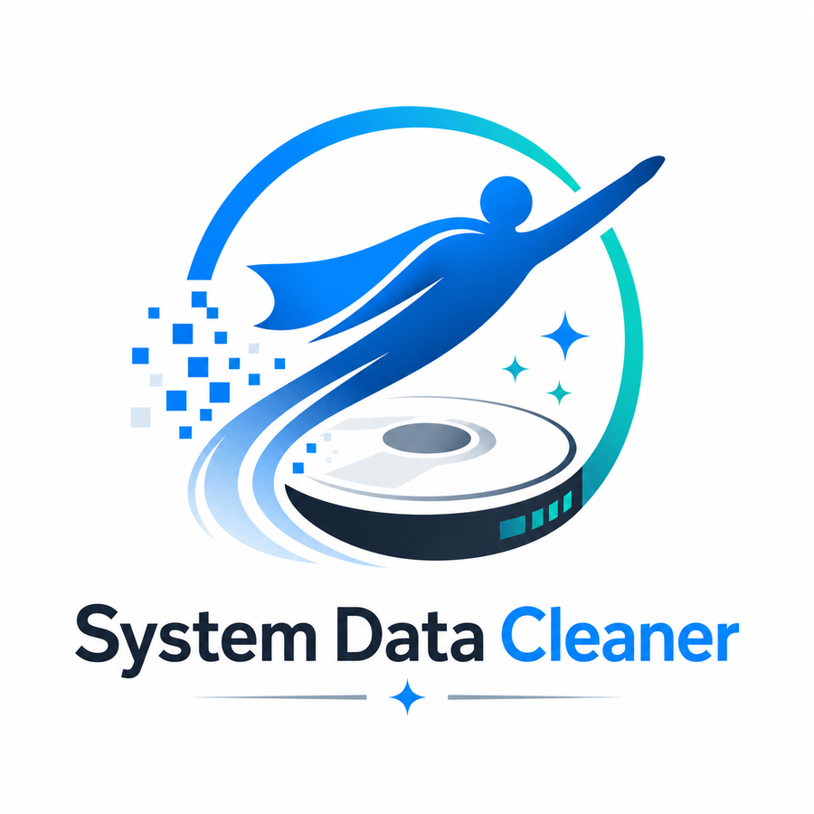

<p align="center">
  
</p>

# System Data Cleaner

A tiny, dependency-free macOS app that finds what's actually filling up your
**"System Data"** and lets you reclaim it — **only after you confirm each
item**. It's a single Bash script wrapped in a double-clickable `.app`, using
native macOS dialogs for all interaction. No frameworks, no telemetry, no
network access.

It was built to solve a real problem: a Mac reporting **~280 GB of opaque
"System Data"** that macOS Storage wouldn't break down and that ordinary
folder-size scanners couldn't explain. The culprit turned out to be invisible
to folder scans entirely (see [the development log](CHANGELOG.md)).

## Why "System Data" gets huge

macOS lumps a grab-bag of things into "System Data": caches, logs, and —
crucially — content stored on **separate mounted APFS volumes** such as Xcode
**Simulator runtimes**. Because those are separate filesystems, a normal
`du`/folder scan skips right over them, so the space appears to vanish. This
tool looks at the *volume and snapshot* layer too, which is what makes the
hidden space visible.

## What it does

When you open the app you get a menu with four modes:

| Mode | What it does | Reads / writes |
|------|--------------|----------------|
| **Sim Runtimes** | Lists **every** installed Xcode simulator runtime (iOS/watchOS/tvOS) with its size. Skip or Delete each (default Skip). Uses Apple's `simctl`; Xcode re-downloads anything removed. | Deletes only what you pick |
| **Disk Map** | Read-only. Enumerates APFS volumes + Time Machine snapshots so you can see space a folder scan can't. | Saves `DiskMap.txt` to Desktop |
| **Deep Scan** | Read-only. Lists the biggest folders on disk. | Saves `SystemData_BigFolders.txt` to Desktop |
| **Quick Clean** | Review & remove common junk: user caches, logs, Trash, Xcode DerivedData/device support, device backups, Thunderbird cached mail, browser/app caches (Chrome, Cursor, Teams, Steam), Homebrew/npm/pip caches, Time Machine local snapshots. **Delete all** or **Choose each**. | Deletes only what you confirm |

Only categories that actually exist on the machine appear, and every path is
resolved from the current user's home directory — there's nothing tuned to one
specific computer.

## Install & run

1. Download `SystemDataCleaner.zip` from the
   [Releases](../../releases) page (or build it yourself — see below) and unzip.
2. The app isn't from the App Store, so the first time:
   **right-click** `SystemDataCleaner.app` → **Open** → **Open** again.
   (Or **System Settings ▸ Privacy & Security ▸ Open Anyway**.)
3. After that, double-click normally.

## Build from source

The whole app is one readable Bash script at
[`src/SystemDataCleaner`](src/SystemDataCleaner). To assemble the `.app`
bundle and a distributable zip:

```bash
./build.sh
# -> build/SystemDataCleaner.app
# -> build/SystemDataCleaner.zip
```

There are no build dependencies beyond a standard macOS install (`bash`,
`osascript`, `zip`). `python3` (bundled with the Xcode command-line tools) is
used only to parse `simctl`'s JSON when the Sim Runtimes mode runs; a text
fallback covers machines without it.

## Safety model

- **Nothing is deleted without your confirmation**, or your explicit
  "Delete all" choice in Quick Clean.
- Cache deletions only target **recognized cache folders** — never logins,
  history, bookmarks, mail accounts, or your projects. A name check refuses any
  path that isn't a known cache directory.
- The macOS system itself, your documents, and external/network Time Machine
  backups are never touched.
- A couple of items (system-wide caches, Time Machine local snapshots) ask for
  an admin password via the standard macOS prompt.
- Because it's an unsigned script app, anyone can audit exactly what it does:
  right-click the app → **Show Package Contents** → `Contents/MacOS`.

## Disclaimer

Provided as-is under the [MIT License](LICENSE), with no warranty. Deleting
files is inherently risky; review each item before confirming, and keep a
backup of anything important.
